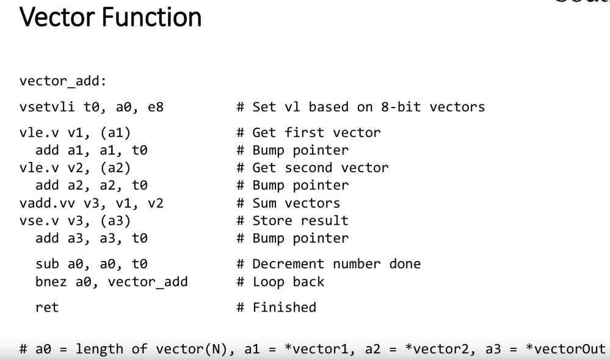
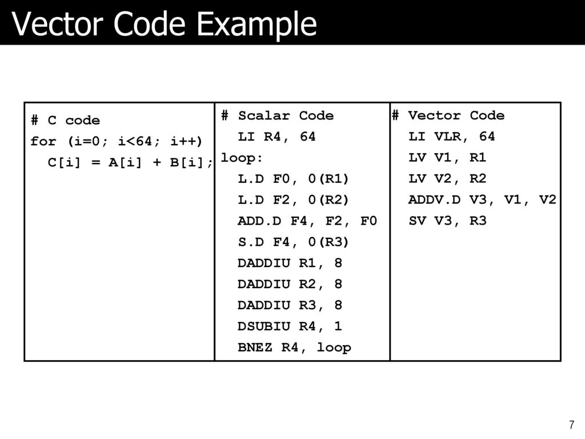
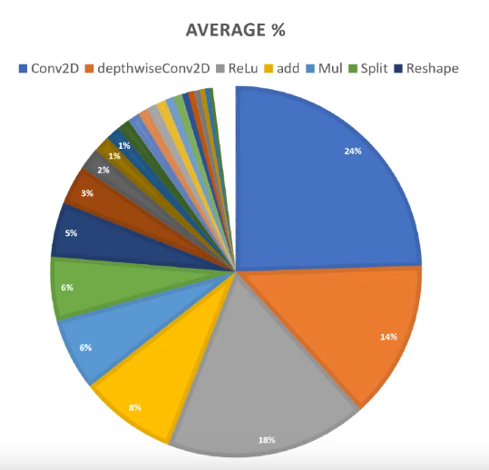
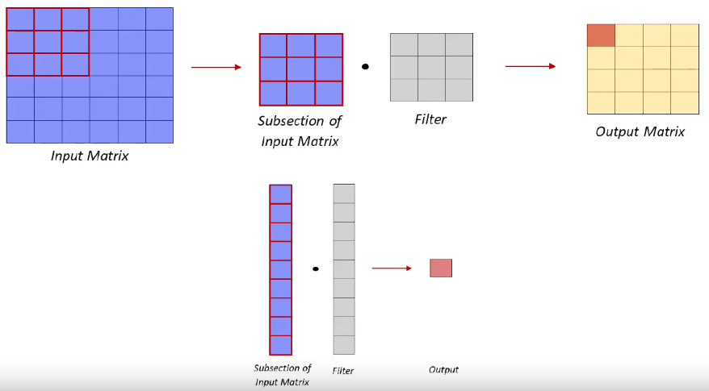
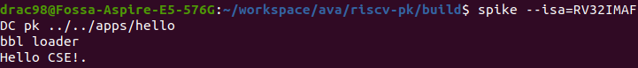
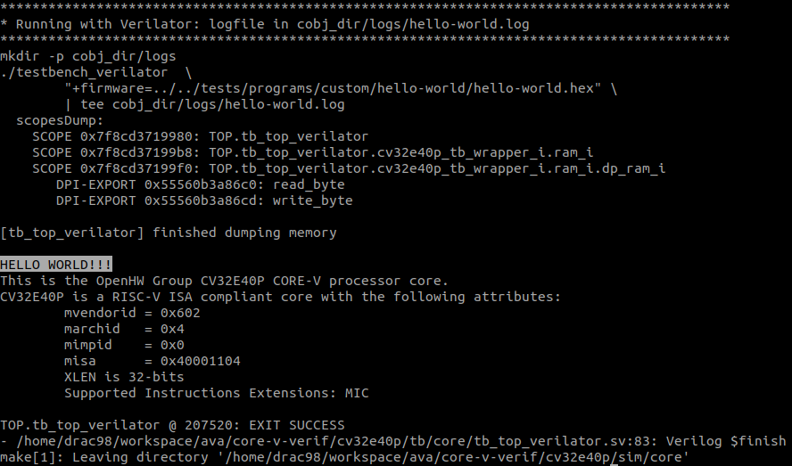

# ava-doc


# Introduction

Vectorization is a massive compile-time reordering of operation sequencing.
Requires extensive loop dependence analysis.

# Vector Machine / Processor

Data level parallalism
Ex: adding two large arrays. Processor will have to load/store multiple times

# RISC-V Vector Extention

`Zve*`: Vector Extensions for Embedded Processors

## Vector Registers

The vector extension adds 32 architectural vector registers, `v0-v31` 
to the base scalar RISC-V ISA.

`ELEN`:The maximum size in bits of a vector element that any operation can produce or consume.
`VLEN`:The number of bits in a single vector register.

## Vector Instruction Formats
The instructions in the vector extension fit under 
two existing major opcodes (LOAD-FP and STORE-FP) and 
one new major opcode (OP-V).


# RVV Assembly



Comparing Scalar and Vector Program


Vector processing is not great for general purpose computing.
- Lower Clock Frequency
- No Out of Order Execution
- Cache is tiny.


Vector processor is really good at specialized tasks:
- Machine 
- Compression both for images, zip files etc
- Cryptography
- Multimedia: audio, video
- Speech and handwriting
- Networking. Parity checks, checksums
- Databases. Hash/joins

In particular Machine Learning has become huge. 
This has become a major focus in data centers. 
- Apple added the Neural Engine on their iPad and iPhone Apple Silicon chips.
- Google made their on Tensor Processing Units (TPU) to offer higher speed machine learning in the crowd.

RISC-V designers David Patterson and Andrew Waterman wrote an article: [SIMD Instructions Considered Harmful](https://www.sigarch.org/simd-instructions-considered-harmful/)

Single Instruction Multiple Data (SIMD) Extention - 
apply the same operation to multiple elements.

SIMD came about in a world where the need was primarily needed 
for short vectors in multimedia settings.


## Commonly Used Neural Network Functions



ML Models use 8bit data for efficiency on small devices

Accelarating Convolution:




# Running a C program on RISC-V

As the first step we'll write a C program and compile it to 32 bit RISC-V 
architecture (RV32I) and  run the program using the Spike RISC-V ISA simulator. 

## Build the Toolchain

Get the source and enter in to the source directory
```
git clone https://github.com/riscv/riscv-gnu-toolchain.git
cd riscv-gnu-toolchain
```
Initialize the submodules
```
git submodule init
git submodule update --init --recursive --progress
```

We'll use the `VERSION="620887bea83ed9016c7552f72ac72e908b2c105a"` of the toolchain.
```
git checkout $VERSION
```

I'll use `$RISCV = /opt/riscv` as the installation directory.

Configure and start the build
``` 
./configure --disable-linux --disable-multilib --disable-gdb --prefix=$RISCV --with-arch=rv32imc --with-abi=ilp32
make -j4
```

`M:` Standard Extension for Integer Multiplication and Division
`C:` Standard Extension for Compressed Instructions

NOTE: 
Recent versions of each which don't support the RISC-V Vector ISA, 
or older versions which do have RVV support.

## Compile a C Program

Programs can be compiled and run in three [different modes](https://lowrisc.org/docs/untether-v0.2/riscv_compile/):
- Bare metal mode: supervisor programs with no I/O accesses. Programs run in this mode have no peripheral support. 
- Newlib mode: supervisor programs **with access to I/O devices**. single-threaded. Bootloaders are run in this mode.
- Linux mode: user programs with Linux support.

We will compile a simple hello world program in Linux mode.
```
#include <stdio.h>

void main()
{
    const char *s = "Hello.\n";
    while (*s) putchar(*s++);
    while(1);
}
```

Compile the program.
```
riscv32-unknown-elf-gcc -o hello hello.c
```

## Test the Program

There are four ways to test a program:
- RISC-V ISA Simulator (Spike).
- RTL Simulation (Verilator): No I/O devices is available in RTL simulation.
- FPGA Simulation: simulate the program using Xilinx ISim
- FPGA Board: Full I/O support (UART and SD).

The ISA simulation is sufficient for us to test the program. 
Follow the instruction to install Spike.

Install dependencies
```
sudo apt update
sudo apt install device-tree-compiler -y 
```

Clone the source
```
git clone https://github.com/riscv/riscv-isa-sim.git
```

Create the build directory
```
mkdir -p ./riscv-isa-sim/build
cd ./riscv-isa-sim/build
```

Configure the build and start building 
```
../configure --prefix=$RISCV
make -j4
```

Install
```
sudo make install -j4
```

As we compiled the program for Linux mode, we need a kernel.
The RISC-V Proxy Kernel([pk](https://github.com/riscv-software-src/riscv-pk)), 
is a lightweight application execution environment that can 
host statically-linked RISC-V ELF binaries. Install `pk` from source.

Clone source
```
git clone https://github.com/riscv/riscv-pk.git
```

Create the build directory
```
mkdir -p ./riscv-pk/build
cd ./riscv-pk/build
```

Configure the build, start building and install
```
../configure --prefix=$RISCV --host=riscv32-unknown-elf
make -j4
sudo make install
```
Now everything is ready to run the program. 

Spike uses the `RV64IMAFDC` ISA by default. So to run a 32bit ISA run it as follows,
```
spike --isa=RV32IMAFDC pk hello
```

Program output:



Generate the Verilator model of the Standard CV32E40P.
```
git clone https://github.com/openhwgroup/core-v-verif.git
cd ./core-v-verif/cv32e40p/sim/core
make
```

The model builds but the sample programs fail to build.
Fix for build issue of Core-V-Verifa: Github Issue [#896](https://github.com/openhwgroup/core-v-verif/issues/896)


Verilator build options
```
verilator --cc --sv --exe \
        --trace \
        --top-module tb_top_verilator \
	  	$(TBSRC_CORE)/tb_top_verilator.sv \
      	$(TBSRC_CORE)/cv32e40p_tb_wrapper.sv \
      	$(TBSRC_CORE)/tb_riscv/riscv_rvalid_stall.sv \
      	$(TBSRC_CORE)/tb_riscv/riscv_gnt_stall.sv \
      	$(TBSRC_CORE)/mm_ram.sv \
      	$(TBSRC_CORE)/dp_ram.sv \
      	-f core-v-cores/cv32e40p/cv32e40p_manifest.flist \
      	core-v-cores/cv32e40p/bhv/cv32e40p_core_log.sv \
	  	$(TBSRC_CORE)/tb_top_verilator.cpp
```

# Vector Toolchain

Checkout to `rvv-0.8.x`
```
git checkout rvv-0.8.x
mkdir -p build
cd build
```

Checkout less broken version of newlib
```
cd riscv-newlib
git checkout 3e5302714fae99acc8c439f5870846312d081631
cd ..
```

Configure
```
./configure --disable-linux --disable-multilib --disable-gdb --prefix=$RISCV --with-arch=rv32imc --with-abi=ilp32
```

Build
```
make -j16
sudo make install -j16
```

# Accelerated Neural Network Functions

# Board Support Package

`libcv-verif.a` (Static Library) : Bare-metal implementations of essential functions usually provided by the OS

- port of the C Runtime
- port of syscalls that does not rely on an OS
- interrupt system 
- vector table.

`link.ld` 
- used to place the C Runtime start up code at the correct address
- changes in the address space in the CV32E40P


# NN Software

algorithms
```
Number of cycles to run just vector_operations: 2006

Number of cycles to run just matrix/pooling_operations: 116535

Number of cycles to run just conv2D_operations: 1989964

Number of cycles to run all NN_operations: 2108505

Total Number of cycles to run testbenchs: 9797705
```

algorithms_vector_assembly
```
Number of cycles to run just vector_operations: 890

Number of cycles to run just matrix/pooling_operations: 91184

Number of cycles to run just conv2D_operations: 1973538

Number of cycles to run all NN_operations: 2065612

Total Number of cycles to run testbenchs: 9717158
```

algorithms_vector_assembly-Optimized-cv32e40p
```
Number of cycles to run just vector_operations: 481

Number of cycles to run just matrix/pooling_operations: 50317

Number of cycles to run just conv2D_operations: 314753

Number of cycles to run all NN_operations: 365551

Total Number of cycles to run testbenchs: 8011656
```

# TinyMLPerf Benchmarking

Benchmarking suite for embedded systems
- Visual Wake Word (based on TFL Micro)
- Audio Wake Word
- Anomaly Detection

```
invocation 1 took 148333103 cycles

Model output: [
0.058594 
0.941406 
]

invocation 2 took 148324867 cycles

Model output: [
0.781250 
0.218750 
]
```

[A simple extension to CV32E40P to accelerate AI inference](https://youtu.be/iNeHMnM17vs)

| Feature | Nexys A7-50T |	 BASYS3 |
|---|---|---|
| FPGA part |	 XC7A50T-1CSG324C |	 XC7A35T-1CPG236C	|
| Logic Slices |	 8,150 | 	 5200	|
| Block RAM (Kbits) |	 2,700 |	 1,800	|
| DDR2 Memory (MiB) |	 128 |	 -	|
| Clock Tiles (with PLL) |	 5 |	 5	|
| DSP Slices |	 120	| 	 90	|

# Progress

- [x] Prepare the Toolchain
- [x] Standard & Accelarated CV32 Verilator Model
- [x] Standard & Accelarated Spike Simulation
- [x] Accelerated Neural Network Functions
- [x] TinyMLPerf Benchmarking
- [ ] SystemVerilog Implementaion of Vector Core
- [ ] Port the core to FPGA
- [ ] Run Testbench on hardware

# Resources

RVV Specification: [Github](https://github.com/riscv/riscv-v-spec/blob/master/v-spec.adoc)
OpenHWGroup Q&A about Vector Extention: [YouTube](https://youtu.be/QzCa3VlflT4?t=2131)
- A research is going on for a application class Vector Co-Processor for CV6 in colloboration with ATH and Polytechnique Montréal
[Register-transfer level](https://en.wikipedia.org/wiki/Register-transfer_level)

- RTL) is a design abstraction which models a synchronous digital circuit in terms of the flow of digital signals (data) between hardware registers, and the logical operations performed on those signals. 

- used in HDLs like Verilog and VHDL to create high-level representations of a circuit, from which lower-level representations and ultimately actual wiring can be derived. Design at the RTL level is typical practice in modern digital design.
 
- Unlike in software compiler design, where the register-transfer level is an intermediate representation and at the lowest level, the RTL level is the usual input that circuit designers operate on.

- A synchronous circuit consists of two kinds of elements: 
1. registers (Sequential logic) and 
2. combinational logic. 

- Registers (usually implemented as D flip-flops)

- Using an EDA tool for synthesis, this description (ex: VHDL code) can usually be directly translated to an equivalent hardware implementation file for an ASIC or an FPGA. The synthesis tool also performs logic optimization. 

At the register-transfer level, some types of circuits can be recognized. If there is a cyclic path of logic from a register's output to its input (or from a set of registers outputs to its inputs), the circuit is called a state machine or can be said to be sequential logic. If there are logic paths from a register to another without a cycle, it is called a pipeline. 

FreeRTOS Port
---
https://github.com/openhwgroup/core-v-docs/blob/master/program/Project%20Descriptions%20and%20Plans/Free%20RTOS/core-v-free-rtos-ppl.md


Goal For Mid Evalutation:
- Understand the current implentation and run it in simlulation.  

Use a real processor with Verilator: CV32E40P


sSupports the **RV32I Base Integer Instruction Set**, version 2.1
following standard instruction set extensions
- 
C: Standard Extension for Compressed Instructions
2.0
always enabled

M: Standard Extension for Integer Multiplication and Division
2.0
always enabled

Zicount: Performance Counters
2.0
always enabled

Zicsr: Control and Status Register Instructions
2.0
always enabled

Zifencei: Instruction-Fetch Fence
2.0
always enabled

F: Single-Precision Floating-Point
2.2
optionally enabled based on FPU parameter

