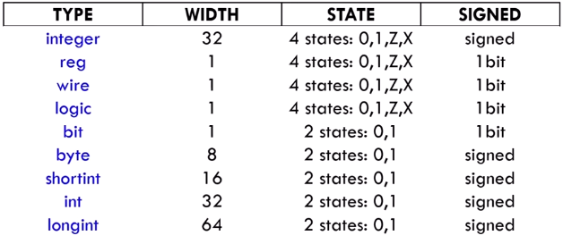

Synthesis: SV design code to digital circuit netlist
Simulation: test the behaviour of design code

Structural Design
Behavioural Design

initial block : start at t=0, simulation construct
```c
module test();

	// initial is where code start to execute
	initial $display("Hello World"); // A pure simulation code
	initial $display("I am the test design block"); // Initial blocks run in parallel
	
	initial begin
		$display("Hello World 1");
		#1 ns;
		$display("Hello World 2");
	end
	
endmodule
```
always block : need a trigger to start, maybe synthesizable
```sv
module test();

	always #1 ns begin 				//sequential statement
		$display("Hello World");
	end
	
endmodule

```
or
```sv
module test(input wire clk);

	always @(clk) begin				// posedge clk, negedge clk
		$display("Hello World");
	end
	
endmodule

```

# Signals modelling

Two syntexes for signals
1. wire - used with continuous assignment, can be connected to multiple drivers
2. reg - used with a sequential statement (aka the `always` block) or with procedural statements


```
module test();
	
	wire w0;
	wire w1, w2;
	wire[7:0] wx8;		// multiple bits version
	
	reg r0;
	reg r1, r2;
	reg[7:0] rx8;

endmodule
```

```
module dut(input wire clk);
	
	wire w0, w1;
	reg r0, r1;
	assign w0 = 1'b1;			// Continuous assignment
	assign w1 = r0 & w0;		// Continuous assignment
	
	always @(posedge clk) begin		// Sequential statement
		r1 = r0 & w0;
	end
	
	initial r0 = 1'b1
	
endmodule
```

New syntax for signals: `logic` - Procedural, Sequential statements and Continuous assignments
```
module dut(input wire clk);
	
	logic l0, l1, l2;
	initial l0 = 1'b1;			// Procedural assignment
	
	always @(posedge clk) begin		// Sequential statement
		l1 = l0;
	end
	
	assign l2 = l1;		// Continuous assignment	
endmodule
```
```
module test();
	wire w0, w1, w2;
	assign w0 = w1;		// Multiple drivers for w0
	assign w0 = w2;		// Multiple drivers for w0
	
	logic l0, l1, l2;
	assign l0 = l1;
	assign l0 = l2;		// Illegal multiple drivers for l0
	
		
endmodule
```

# Numerical Variables


Z: High impedence (No voltage ex: disconnected)
X: Unknown


wire, reg, logic are used for Signals modelling in synthesis and as Variables in simulation.
