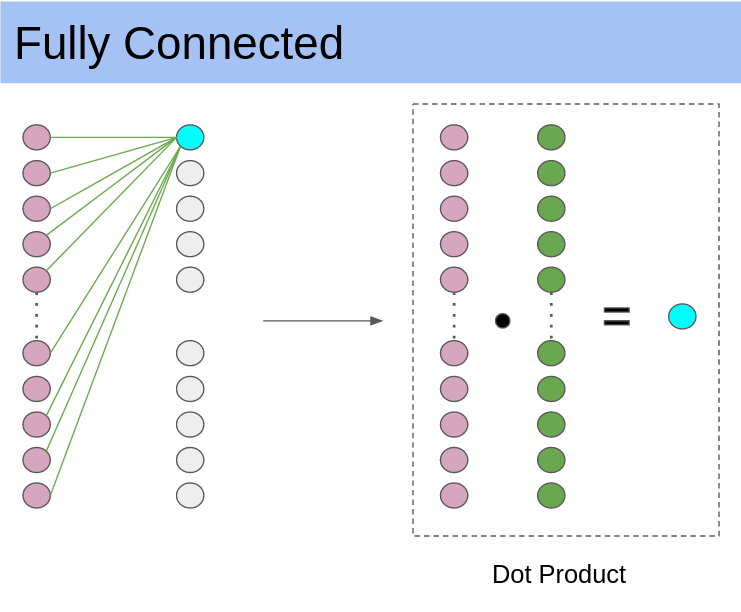

# Optimizing Dense/Fully Connected Operation

[Github Repository](https://github.com/drac98/NN_software/commits/dense)

## Vector ISA

six unprivileged CSRs to a base scalar RISC-V ISA.
- `vstart`: Vector start position
- vxsat
- vxrm
- `vtype` : Vector data type register
- `vl` : Vector length
- vlenb : VLEN/8 (vector register length in bytes)

The `vsetvli` instruction sets the `vtype` and `vl` CSRs based on its 
arguments, and writes the new value of `vl` into `rd`.

ELEN : The maximum size of a single vector element in bits
VLEN : vector register length in bits
SLEN : The striping distance in bits (VLEN ≥ SLEN ≥ 32)
LMUL : number of vector registers in a group
AVL : application vector length



Vector Dot Product Assembly
```
vect_add:    
	.globl   vect_add
	vsetvli t0, a0, e8, m4, d1 			# Set vector length based on 8-bit vectors, group 4 VecReg together for efficiency 
	vle.v v4, (a1)          			# Get first vector
	  add a1, a1, t0         			# Bump pointer
	vle.v v8, (a2)          			# Get second vector
	  add a2, a2, t0       			  	# Bump pointer    
	vsadd.vv v12, v4, v8     			# Sum vectors    
	  sub a0, a0, t0        		 	# Decrement number done
	vse.v v12, (a3)         		 	# Store result      
      add a3, a3, t0       			 	# Bump pointer      
      bnez a0, vect_add   				# Loop back      
      ret                  			  	# Finished
```
m4 : `vlmul` - Vector Register Grouping
d1 : `vediv` - Divided Element Extension. The divided element extension allows each element to be treated as a packed sub-vector of narrower elements.


Vectorized Fully Connected Operation
```
void fully_connected(
	const uint32_t N, 
	const uint32_t out,
	int8_t data[N],
	int8_t weights[out][N],
	int8_t output[out]){

    for(int i = 0; i<out; i++){
        vect_dotProduct(N, data, &weights[i], &output[i]);
    }
}
```

### Testbench

| Inputs (N) | Outputs (out) | Standard Cycle Count | Vector Cycle Count | Optimized CV32E40P Cycle Count |
| 30 |	 40 |	 15234	| 10873 | 7033 (x2.1) |
| 512 |	 512 |	 3156002	| 2043426 | 1224737 (x2.5) |
