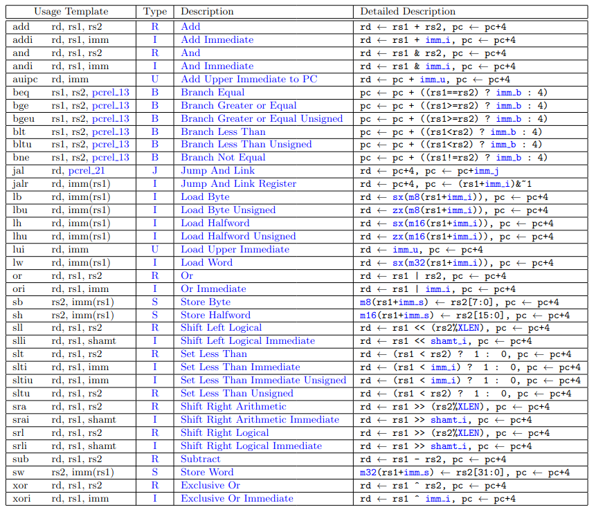

31 Genaral Purpose Registers (`x1, x2, ..., x31`)
2 Special Purpose Registers
- `x0` : Hardwired to zero. (Value zero or Logical false)
- `pc` : Program Counter. Keep track of next instruction to execute.

Hart (core) : Hardware Thread
Each hart has its own
- 32 Registers
- Instruction Execution Unit
- ALU

RISC-V CPUs have one or more harts.

Programs written to take advantage of harts is called multithreaded.

# RV Base Modules

RV32I
- `32` : 32 bit registers and program counter
- `I`: Equipped to handle Integer instructions
- 40 Instructions (5/6 general groups)

Applications: Microwaves, Coffee Pots, Railroad crossing gate controls, Water plant motor controllers, Quadcopters

To multiply it will add successively

RV32E
- same as RV32I but only has 16 registers instead of 32

RV64I
RV128I

# Extension Modules

M : Integer Math (Multiply, Divide)
A : Atomic
F, D, Q : 32, 64, 128 bit floating point units respectively
C : Compressed Size Instructions

G : General Purpose CPU. Represnets the combined set of IMAFD extension

Instruction Cycle : Fetch, Decode, Execute

In RV32 the PC address will increment by 4 because it's the word size. 
But for branch/jump instructions the PC will get a calculated value.

jump: unconditional branch (change)
branch : conditional change

In RV the branching does the compare and jump or not in single instruction because there is no flags in RV (reduces cost) 

https://www.youtube.com/watch?v=LKB5I12LctU&list=PL3by7evD3F53Dz2RiB47Ztp9l_piGVuus

